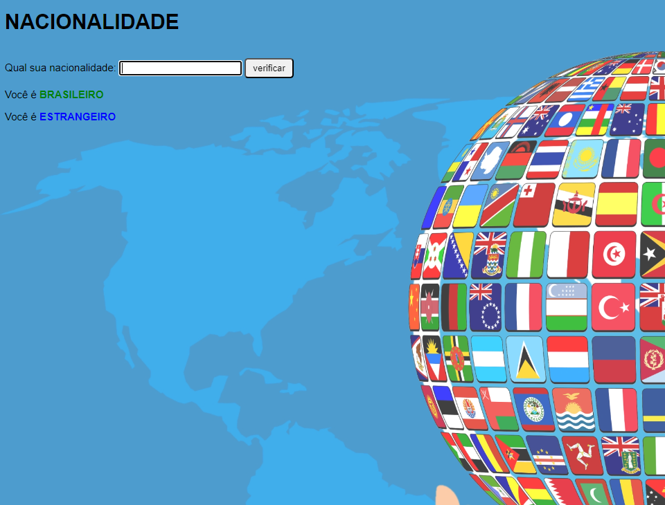

# nacionalidade

<h1> NACIONALIDADE </h1>

Esse projeto é bem básico, somento estou postando aqui para compartilhar minha jornada.

  <a href="#-tecnologias">Tecnologias</a>&nbsp;&nbsp;&nbsp;|&nbsp;&nbsp;&nbsp;
  <a href="#-projeto">Projeto</a>&nbsp;&nbsp;

 

  

## 🚀 Tecnologias

Esse projeto foi desenvolvido com as seguintes tecnologias:

- HTML e CSS
- JavaScript
- Git e Github
- Figma

## 💻 Projeto

esse projeto é básico, simplismente mostra se é estrangeiro ou brasileiro!

